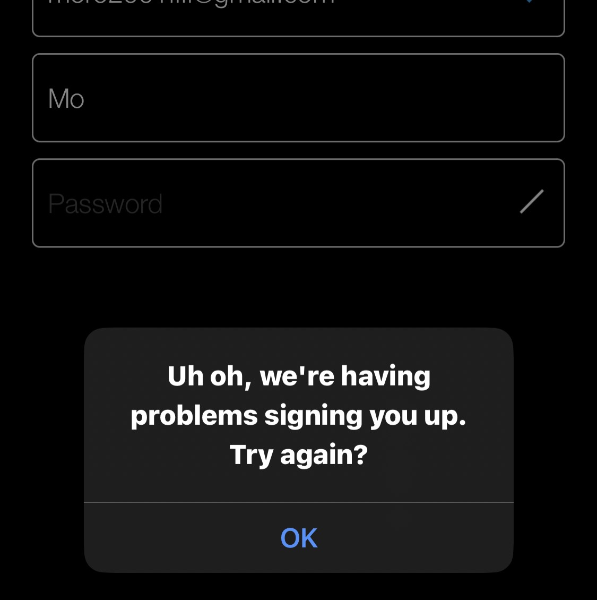
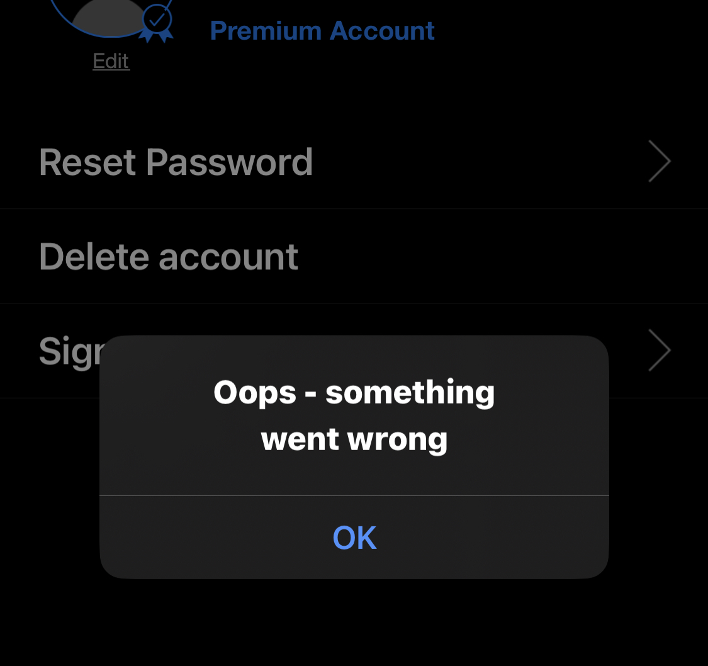
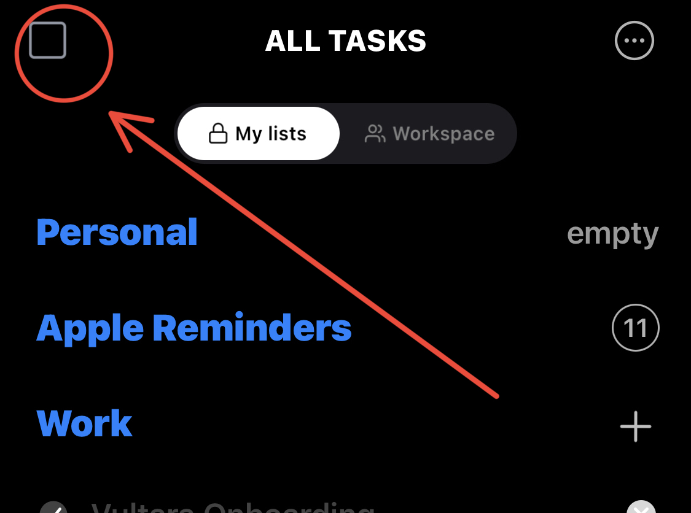

# HELLO,
___
## **First Part: Test Design**

___
## **Second Part: Bug Reporting**
### Any.do Bugs Reports:
### BugID: B-1
##### **Submitted by**: Omar Ahmed
##### **Title**:  Sign in manually (without external provider) failure
##### **Reproducible steps**:
###### 1- launch the app
###### 2- click on the envelope icon
###### 3- enter an unregistered email & and a password
###### 4- click on create account
##### **Results** → Expected: success message/dialogue | Actual: failure message box
##### **Attachments**:
##### **Affected devices**: iPhone X | iOS 16.7.2 | Any.do Version 5.40.13.1698
##### **Network**: WiFi
##### **Severity**: Minor
##### **Priority**: Medium
##### **Impact**: High
___
### BugID: B-2
##### **Submitted by**: Omar Ahmed
##### **Title**:  Edit full name effect goes away after re-signing in
##### **Reproducible steps**:
###### 1- Navigate to profile settings
###### 2- click on the pen icon next to full name and update it
###### 3- sign out from the account, sign in again
###### 4- navigate to profile settings again
##### **Results** → Expected: updated full name | Actual: old full name
##### **Attachments**:NA
##### **Affected devices**: iPhone X | iOS 16.7.2 | Any.do Version 5.40.13.1698
##### **Network**: WiFi
##### **Severity**: Minor
##### **Priority**: Medium
##### **Impact**: Medium
___
### BugID: B-3
##### **Submitted by**: Omar Ahmed
##### **Title**:  Deleting user account does not succeed
##### **Reproducible steps**:
###### 1- Navigate to profile settings
###### 2- click on the delete account option > click I'm sure
###### 3- write your password > click delete account
##### **Results** → Expected: success message > log out | Actual: failure message box
##### **Attachments**:
##### **Affected devices**: iPhone X | iOS 16.7.2 | Any.do Version 5.40.13.1698
##### **Network**: WiFi
##### **Severity**: Major
##### **Priority**: Medium
##### **Impact**: High
___
### BugID: B-4
##### **Submitted by**: Omar Ahmed
##### **Title**:  Restore previous transactions does not respond
##### **Reproducible steps**:
###### 1- Navigate to profile settings
###### 2- click on the Restore transactions
##### **Results** → Expected: dialogue specifies the behavior | Actual: nothing happens
##### **Attachments**:NA
##### **Affected devices**: iPhone X | iOS 16.7.2 | Any.do Version 5.40.13.1698
##### **Network**: WiFi
##### **Severity**: Critical
##### **Priority**: High
##### **Impact**: High
___
### BugID: B-5
##### **Submitted by**: Omar Ahmed
##### **Title**:  Changing first day of the week effect goes away after re-signing in
##### **Reproducible steps**:
###### 1- Navigate to settings > scroll down to week starts on
###### 2- click on the day itself, stop when the day you want shows up
###### 3- sign out from the account, sign in again
###### 4- navigate to settings again > scroll down to week starts on
##### **Results** → Expected: updated day | Actual: Monday
##### **Attachments**:NA
##### **Affected devices**: iPhone X | iOS 16.7.2 | Any.do Version 5.40.13.1698
##### **Network**: WiFi
##### **Severity**: Major
##### **Priority**: Medium
##### **Impact**: High
___
### BugID: B-6
##### **Submitted by**: Omar Ahmed
##### **Title**:  Bad notification button UX
##### **Reproducible steps**:
###### 1- launch the app, make sure you are signed in
###### 2- navigate to calendar, all tasks, my day, or next 7 days
###### 3- click on the checkbox on the upper left corner
##### **Attachments**:
##### **Affected devices**: iPhone X | iOS 16.7.2 | Any.do Version 5.40.13.1698
##### **Network**: WiFi
##### **Severity**: Minor
##### **Priority**: Medium
##### **Impact**: Low
___
### BugID: B-7
##### **Submitted by**: Omar Ahmed
##### **Title**:  Landscape orientation not supported
##### **Reproducible steps**:
###### 1- launch the app, make sure you are signed in, turn portrait orientation lock off, rotate it 90d.
###### 2- navigate to calendar, all tasks, my day, next 7 days, settings, profile settings 
##### **Results** → Expected: responsive screen rotation | Actual: operates in portrait orientation
##### **Attachments**:NA
##### **Affected devices**: iPhone X | iOS 16.7.2 | Any.do Version 5.40.13.1698
##### **Network**: WiFi
##### **Severity**: Minor
##### **Priority**: Low
##### **Impact**: Low
___
### BugID: B-8
##### **Submitted by**: Omar Ahmed
##### **Title**:  Poor choice of naming option (match system color theme)
##### **Reproducible steps**:
###### 1- launch the app, navigate to settings
###### 2- scroll down to dynamic theme, turn it on
##### **Results** → Expected: A name that expresses the option (ex: Match System Theme) | Actual: Dynamic theme
##### **Attachments**:NA
##### **Affected devices**: iPhone X | iOS 16.7.2 | Any.do Version 5.40.13.1698
##### **Network**: WiFi
##### **Severity**: Low
##### **Priority**: Low
##### **Impact**: Low
___
## **Third Part: Test Automation**
### Swag Labs Login Test Cases:
**TC_ID** | TC_01 
---|---
**Objective** | `Aims to test the daily scenario where users enter a valid credentials`  
**Pre-requisite** | having a registered  username & password          
**Steps** | open login URL > enter credentials > click Login          
**Expected Result** | navigating to inventory page         
**Actual Result** | navigating to inventory page         
**Status**  | *PASSED* 
**Assigned to**  | Omar Ahmed 
___

**TC_ID** | TC_02 
---|---
**Objective** | `Testing a regular user when he spells his username wrong`  
**Pre-requisite** | none          
**Steps** | open login URL > enter desired credentials > click Login          
**Expected Result** | displays failure message         
**Actual Result** | displays failure message         
**Status**  | *PASSED* 
**Assigned to**  | Omar Ahmed
___
**TC_ID** | TC_03 
---|---
**Objective** | `Testing a regular user when he enters a wrong password`  
**Pre-requisite** | none          
**Steps** | open login URL > enter desired credentials > click Login          
**Expected Result** | displays failure message         
**Actual Result** | displays failure message         
**Status**  | *PASSED* 
**Assigned to**  | Omar Ahmed
___
**TC_ID** | TC_04 
---|---
**Objective** | `Testing when a new user trying to sign in instead of sign up`  
**Pre-requisite** | none          
**Steps** | open login URL > enter desired credentials > click Login          
**Expected Result** | displays failure message         
**Actual Result** | displays failure message         
**Status**  | *PASSED* 
**Assigned to**  | Omar Ahmed
___
**TC_ID** | TC_05 
---|---
**Objective** | `Testing a miss click done by the user before filling the form`  
**Pre-requisite** | none          
**Steps** | open login URL > leave input fields empty > click Login          
**Expected Result** | displays failure message         
**Actual Result** | displays failure message         
**Status**  | *PASSED* 
**Assigned to**  | Omar Ahmed
___
**TC_ID** | TC_06 
---|---
**Objective** | `Testing privacy requirement where a password cannot be human readable`  
**Pre-requisite** | none          
**Steps** | open login URL > filling the password field/checking the input type          
**Expected Result** | input type is 'password'         
**Actual Result** | input type is 'password'         
**Status**  | *PASSED* 
**Assigned to**  | Omar Ahmed
___
**TC_ID** | TC_07 
---|---
**Objective** | `Testing a practical user tries to login with ENTER key instead of clicking login`  
**Pre-requisite** | having a registered  username & password          
**Steps** | open login URL > enter credentials > Press Enter          
**Expected Result** | navigating to inventory page         
**Actual Result** | navigating to inventory page         
**Status**  | *PASSED* 
**Assigned to**  | Omar Ahmed 
___
**TC_ID** | TC_08 
---|---
**Objective** | `Testing if the site logs out after navigating back to the login page`  
**Pre-requisite** | having a registered  username & password          
**Steps** | open login URL > enter credentials > click login > navigate backward > navigate forward          
**Expected Result** | stuck at login page         
**Actual Result** | navigates to inventory page         
**Status**  | *FAILED* 
**Assigned to**  | Omar Ahmed 
___
**TC_ID** | TC_09 
---|---
**Objective** | `Testing if the user browser directed him to the inventory instead of login page`  
**Pre-requisite** | none          
**Steps** | open inventory URL     
**Expected Result** | re-direct to login page         
**Actual Result** | re-direct to login page         
**Status**  | *PASSED* 
**Assigned to**  | Omar Ahmed 
___
| Total TCs | Passed | Failed | Perc. | Producible |
| --------- |:------:| ------:| -----:| ----------:|
| 9 Tests   | 8 Tests| 1 Test | ~0.89 | No         |

